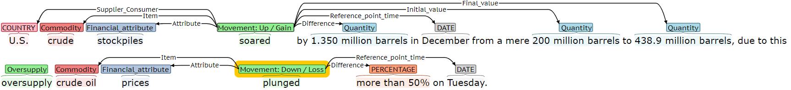

# Commodity-News-Corpus

This folder contains the files of the Commodity News Corpus, which is made up of a pair of files : a text file (.txt) containing the link to the news article and a annotation file (.ann) containing the annotation details. Pre-processing and post-processing codes are provided for the re-producibility of experiment results.

## Summary information
The dataset contains about 8,500 sentences, over 3,075 events, 21 Entity Types, 19 Event Types and 21 Argument Roles. More details can be found in subsections below.

### Entity Types
21 Entity types covering both named and nominal entities
  |      Entity Types     |                                  Examples                                   |
  |-----------------------|-----------------------------------------------------------------------------|
  | 1. Commodity          | *oil, crude oil, Brent, West Texas Intermediate (WTI), fuel, U.S Shale*     | 
  | 2. Country**          | *Libya, China, U.S., Venezuela, Greeze*                                     |
  | 3. Date**             | *1998, Wednesday, Jan. 30, the final quarter of 1991, the end of this year* |
  | 4. Duration**         | *two years, three-week, 5-1/2-year, multiyear, another six months*          |
  | 5. Economic Item      | *economy, economic growth, market, economic outlook, employment data*       |
  | 6. Financial attribute| *supply, demand, output, production, price, import, export*                 |
  | 7. Forecast target    | *forecast, target, estimate, projection, bets*                              |
  | 8. Group              | *global producers, oil producers, hedge funds, non-OECD, Gulf oil producers*|
  | 9. Location**         | *global, world, domestic, Middle East, Europe*                              |
  | 10. Money**           | *$60, USD 50*                                                               |
  | 11. Nationality**     | *Chinese, Russian, European, African*                                       |
  | 12. Number**          | (any numerical value that does not have a currency sign)                    |
  | 13. Organization**    | *OPEC, Organization of Petroleum Exporting Countries, EIA*                  |
  | 14. Other activities  | (free text)                                                                 |
  | 15. Percent**         | *25%, 1.4 percent*                                                          |
  | 16. Person**          | *Trump, Putin* (and other political figures)                                |
  | 17. Phenomenon        | (free text)                                                                 |
  | 18. Price Unit        | *$100-a-barrel, $40 per barrel, USD58 per barrel*                           |
  | 19. Production Unit   | *170,000 bpd, 400,000 barrels per day, 29 million barrels per day*          |
  | 20. Quantity          | *1.3500 million barrels, 1.8 million gallons, 18 million tonnes*            |
  | 21. State or province | *Washington, Moscow, Cushing, North America*                                |
  
### Event Types
19 event types
  1. **Geo-political News**
      - Civil unrest (*civil-unrest*):  Violence or turmoil within the oil producing country.
      - Other forms of Crisis (*Crisis*): A time of intense difficulty. 
      - Embargo (*Embargo* / *Prohibiting*): Trade or other commercial activity of the commodity is banned.
      - Geo-political tension: Political tension between oil-producing nation with other nations. 
      - Trade tensions (*Trade-tensions*): Trade-related tension between oil-producing and oil-consuming nations. 
  2. **Macro-economic News
      - Employment (*Grow-strong* / *Slow-weak*): Status of US Employment Data, which is an indicator of economic situation. 
      - Economy / GDP (*Grow-strong* / *Slow-weak*): Economic / GDP growth of a nation.
      - Bearish technical view / outlook (*Negative-sentiment*): Bearish sentiment or outlook
  3. **Commodity Supply (includes exports)**
      - Oversupply (*Oversupply*): Situation where production goes into surplus.
      - Shortage (*Shortage*): Situation where demand is more than supply.
      - Supply increase (*Movement-up-gain*): Situation where supply increased.
      - Supply increase (*Cause-movement-up-gain*): Deliberate action to increase supply.
      - Supply decrease (*Movement-down-loss*): Situation where supply decreased.
      - Supply decrease (*Cause-movement-down-loss*): Deliberate action to decrease supply. 
  4. **Commodity Demand (includes imports)**
      - Demand increase (*Movement-up-gain*): Situation where demand increased.
      - Demand decrease (*Movement-down-loss*): Situation where demand decreased.
  5. **Commodity Price Movement** (Commodity price here includes *spot price*, *futures* and *futures contract*.)
      - Price increase (*Movement-up-gain*): Situation where commodity price rises.
      - Price decrease (*Movement-down-loss*): Situation where commodity price drops.
      - Price movement flat (*Movement-flat*): Situation where no or little change to commodity price.
      - Price target /forecast increase (*Caused-movement-up-gain*): Commodity forecasted / target price is raised.
      - Price target /forecast decrease (*Caused-movement-down-loss*): Commodity forecasted / target price is lowered.
      - Price position (*Position-high*, *Position-low*): Describes the position of the current commodity price.

There are 3,075 events and their distributions are as follows:
  |      Event Type                                   |        Ration        |     # Sentence      |
  |---------------------------------------------------|----------------------|---------------------|
  | 1. Cause-movement-down-loss                       |        14.9%         |        457          |
  | 2. Cause-movement-up-gain                         |           2%         |         63          |
  | 3. Civil-unrest                                   |         2.6%         |         79          |
  | 4. Crisis                                         |         1.2%         |         36          |
  | 5. Embargo                                        |         4.8%         |        148          |
  | 6. Geopolitical-tensions                          |           2%         |         63          |
  | 7. Grow-strong                                    |           6%         |        183          |
  | 8. Movement-down-loss                             |          24%         |        753          |
  | 9. Movement-flat                                  |         2.6%         |         80          |
  | 10. Movement-up-gain                              |          15%         |        461          |
  | 11. Negative-sentiment                            |        4.07%         |        125          |
  | 12. Oversupply                                    |         3.8%         |        116          |
  | 13. Position-high                                 |        3.06%         |         94          |
  | 14. Position-low                                  |        3.58%         |        110          |
  | 15. Prohibiting                                   |         0.9%         |         28          |
  | 16. Shortage                                      |           1%         |         31          |
  | 17. Situation-deteriorate                         |         1.1%         |         35          |
  | 18. Slow-weak                                     |        5.79%         |        178          |
  | 19. Trade-tensions                                |         1.7%         |         53          |

### Argument Roles
21 Argument roles - 

Please refer to the annotation guide for list of events and its corresponding list of argument roles.

For complete list of the above, please refer to **Event Annotation Guidelines.pdf**.

The diagram below shows the annotation details using the tool called Brat Annotation Tool.

## Preprocessing
In data pre-processing, the annotation information in Brat standoff format (.ann file) is combined with the text (.txt file) to produce a corresponding .json file as input to the event extraction model.
