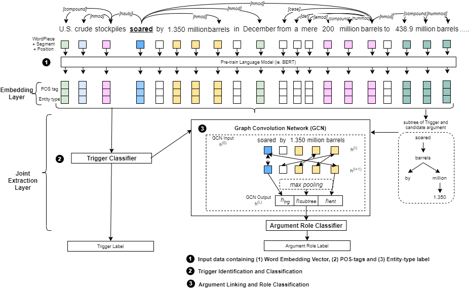

# Commodity News Event Extraction 

## Introduction
This repository contains PyTorch code for the paper entitled **"Effective Use of Pre-trained Language Models and Graph Convolution Network over Contextual Sub-dependency Parse Tree for Event Extraction in Commodity News"**

This paper introduces the use of pre-trained language models, eg: BERT and Graph Convolution Network (GCN) over a sub-dependency parse tree, termed here as **Contextual Sub-Tree** for event extraction in Commodity News. Below is a diagram showing the overall architecture of the proposed solution. 



The events found in Commodity News are group into three main categories:
1. Geo-political events
2. Macro-economic events
3. Commodity Price Movement events

## Requirements
1. Python 3 (own version is 3.7.4)
2. PyTorch 1.2
3. Transformer (own version is 2.11.0) - [Huggingface](https://huggingface.co/transformers/)
4. Stanford CoreNLP

To install the requirements, run ```pip -r requirements.txt```.

## Repository contents
- ```dataset``` 
- ```data```
- ```utils```
- ```model```
- ```runs```
- 

## How to run the codes
Run ````run_train.bat ```

## Output
The results are written to (1) Tensorboard and (2) "runs/logfiles/output_XX.log' where XX is the system date and timestamp. Results include
1. Training loss
2. Evaluation loss
3. Event Trigger classification Accuracy, Precision, Recall and F1 scores.
4. Argument Role classification Accuracy, Precision, Recall and F1 scores.

To access results on Tensorboard, first you need to have Tensorboard install and to bring up to bring up tensorboardX, use this command: ```tensorboard --logdir runs```

## Citation
If you find the codes or the paper useful, please cite using the following:
